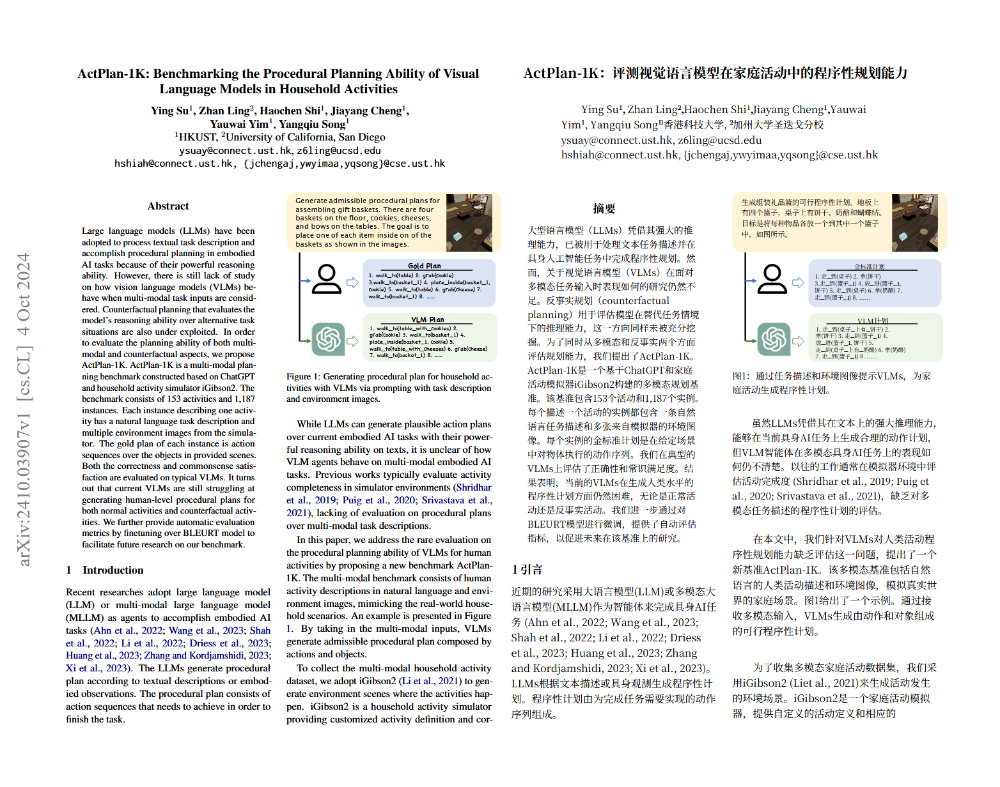

<p align="center">
  
</p>

<h1 align="center">Codex Bilingual Reader for Zotero</h1>

<p align="center">Preserved-layout English/Chinese paper translation powered by Codex or OpenAI-compatible APIs.</p>

<p align="center">
  <a href="https://github.com/Mengqi97/codex-bilingual-reader-for-zotero/releases/latest"></a>
  <a href="https://github.com/Mengqi97/codex-bilingual-reader-for-zotero/actions/workflows/ci.yml"></a>
  <a href="LICENSE"></a>
</p>

An MIT-licensed Zotero 8/9 plugin that creates a **preserved-layout English/Chinese PDF** from a PDF attachment using either the locally logged-in Codex CLI or an OpenAI-compatible API such as OpenAI or DeepSeek. The bilingual PDF is saved as a separate Zotero child attachment; the original is never modified.

## Output modes

The default mode is **preserved bilingual PDF**: PDFMathTranslate-next/BabelDOC retains figures, tables, formulas, and page geometry while placing the translation beside the source. It is a separate artifact, not an edit of the original PDF.

The plugin generates and imports only the bilingual PDF.

## Core features

- **Preserved-layout bilingual PDF** — keeps figures, formulas, tables, selectable text, and page geometry while placing English and Chinese side by side.
- **Codex or API translation** — use the locally authenticated Codex CLI, OpenAI, DeepSeek, or another OpenAI-compatible endpoint.
- **Single and batch translation** — translate one paper or queue multiple selected papers with running, waiting, cancellation, and resumable checkpoints.
- **Native Zotero workflow** — start from the Tools menu, item context menu, or right-hand pane; completed PDFs are imported automatically without modifying the original.
- **Task and cost tracking** — view page/fragment progress, elapsed time, actual API token usage, configurable pricing, and failures in one task center.
- **Bilingual PDF controls** — choose translation side, prefer the original or bilingual attachment on open, preview the result, and adjust the center gap without retranslating.

## Preview



English is preserved on the left and the translated, selectable Chinese page is placed on the right while figures, formulas, tables, and page geometry remain intact.

## Installation

1. Download `codex-bilingual-reader.xpi` from the [latest GitHub Release](https://github.com/Mengqi97/codex-bilingual-reader-for-zotero/releases/latest).
2. In Zotero, open **Tools → Add-ons**, choose **Install Add-on From File…**, and select the XPI.
3. Clone or download this repository, install PDFMathTranslate-next separately, then open **Tools → Codex 中英对照设置…** and select the local workspace. The external AGPL engine is intentionally not bundled in the MIT-licensed XPI.
4. Select either the locally authenticated Codex CLI or an OpenAI-compatible API and run **Test connection** before translating a paper.

## Preserved-layout PDF setup

Before the first translation, open **Tools → Codex 中英对照设置…** and click **选择工作目录并自动配置…**. Choose this repository's root folder; the plugin fills the launcher and PDFMathTranslate paths and runs a local preflight. Manual path entry remains available for custom layouts. Select Codex CLI or an OpenAI-compatible API, configure its model and credentials, then use **测试连接**. The launcher also needs `pdftoppm`, `pdftotext`, and Python 3; the current Windows installation is discovered automatically.

This design uses an external engine because PDFMathTranslate-next/BabelDOC is AGPL-licensed. The MIT plugin does not copy, bundle, or link that engine. See [the preserved PDF workflow](docs/PDF_PRESERVATION_WORKFLOW.md) for provider contracts, privacy boundaries, license boundary, and acceptance gates.

### Verified local proof of concept

The repository includes a local-only integration proof of concept, verified on Windows with `pdf2zh-next 2.9.0` and a logged-in Codex CLI. It generated a left/right Chinese-English PDF from a 21-page paper; the output had the same page count and retained text, formulas, vector drawings, tables, and images.

The launcher uses PDFMathTranslate's `CLITranslator` boundary and a local batch broker. The broker dispatches each batch either to isolated `codex exec` calls or to the configured OpenAI-compatible Chat Completions endpoint.

Scanned PDFs are not OCRed by this plugin. Run OCR in Zotero first so it has an accessible full-text index.

## Security and privacy

With Codex CLI, source fragments are submitted through the user's local Codex login and the plugin never reads or copies Codex credentials. With API mode, the configured API key remains in the local Zotero preference profile and is sent only as a Bearer credential to the configured Base URL. Document text is sent to the selected provider for translation.

On Windows, preserved-PDF mode uses the configured `codex.cmd` or `codex.exe` and the configured Codex Home directory. The external launcher passes file paths as process arguments and sends document fragments to Codex through stdin; it never interpolates PDF text into a shell command.

## Development

Requirements: Node.js 20+ and Zotero 8+.

```powershell
npm run check
npm test
npm run build
```

The distributable is `build/codex-bilingual-reader.xpi`. Install it from Zotero's Add-ons window and restart Zotero. For a selected paper, start translation from any of these equivalent entries:

- **Tools → 使用 Codex 生成全文中英对照**
- The selected item’s right-click menu
- The **Codex 中英对照** section in Zotero’s right-hand item pane (with a matching sidebar icon)

## Translation settings

Open **Edit → Settings → Codex 中英对照**, use **Tools → Codex 中英对照设置…**, or use the **翻译设置** button in the right-hand pane.

- **Preserved PDF** (default): follows the selected backend. Codex CLI uses the local login and PDF reasoning level; API mode supports OpenAI-compatible Chat Completions providers including OpenAI and DeepSeek.
- **Default open attachment**: choose whether double-clicking a paper prefers its bilingual PDF or keeps Zotero's original-PDF behavior.
- **Test connection**: validates the preserved-PDF launcher and sends one minimal sentence through the selected backend. It never sends a document.

## Known limitations

- Zotero's full-text cache does not retain a robust paragraph-to-PDF coordinate map, so the MVP does not jump from a bilingual row back to an exact PDF location.
- Preserved PDF requires a separately installed PDFMathTranslate-next engine plus either a valid local Codex CLI login or a working OpenAI-compatible API configuration.
- Exact token usage is shown only when an API provider returns a standard `usage` object. Codex CLI tasks do not currently expose authoritative token counts.
- The Codex App Server requires a valid `~/.codex/config.toml`. If it reports a TOML parse error, fix the named line or restore a known-good configuration backup, then retry.
