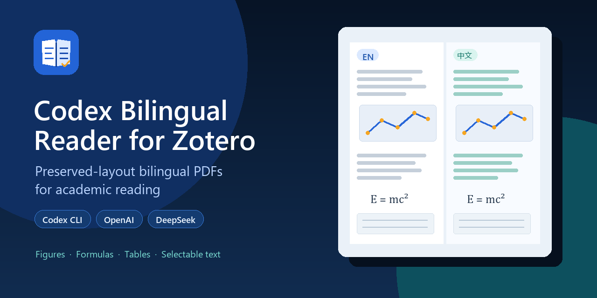

<p align="center">
  
</p>

<h1 align="center">Codex Bilingual Reader for Zotero</h1>

<p align="center">由 Codex 或 OpenAI 兼容 API 驱动的保排版中英论文翻译插件<br>Preserved-layout English/Chinese paper translation powered by Codex or OpenAI-compatible APIs</p>

<p align="center">
  <a href="https://github.com/Mengqi97/codex-bilingual-reader-for-zotero/releases/latest"></a>
  <a href="https://github.com/Mengqi97/codex-bilingual-reader-for-zotero/actions/workflows/ci.yml"></a>
  <a href="LICENSE"></a>
</p>

<p align="center"><a href="#中文">简体中文</a> · <a href="#english">English</a></p>



## 中文

Codex Bilingual Reader 是一个适用于 Zotero 8/9 的 MIT 开源插件。它可通过本地已登录的 Codex CLI，或 OpenAI、DeepSeek 等 OpenAI 兼容 API，将 PDF 附件转换为**保留原排版的中英对照 PDF**。生成结果会作为独立的 Zotero 子附件自动导入，原始 PDF 始终不会被修改。

### 核心功能

- **保排版中英对照 PDF**：保留图片、公式、表格、可选择文字和页面几何结构，并将英文与中文并列排版。
- **Codex 与多种 API 后端**：支持本地 Codex CLI、OpenAI、DeepSeek 及其他 OpenAI 兼容接口。
- **单篇与批量翻译**：支持翻译单篇论文或批量加入队列，并显示运行、等待、取消和断点续传状态。
- **原生 Zotero 操作入口**：可从工具菜单、条目右键菜单或右侧面板启动；完成后自动导入双语 PDF。
- **任务与费用统计**：集中查看页数/片段进度、运行时间、实际 API Token 用量、可配置价格及失败信息。
- **双语 PDF 设置**：可选择译文位于左侧或右侧、默认打开原文或双语附件、预览输出，并可单独调整中缝宽度而无需重新翻译。

### 效果展示


上图中英文位于左侧，可选择的中文译文位于右侧；图片、公式、表格和页面结构均得到保留。

### 安装

1. 从[最新 GitHub Release](https://github.com/Mengqi97/codex-bilingual-reader-for-zotero/releases/latest)下载 `codex-bilingual-reader.xpi`。
2. 在 Zotero 中打开**工具 → 附加组件**，选择**从文件安装附加组件…**，然后选择下载的 XPI。
3. 打开**工具 → Codex 中英对照设置…**。Windows 点击**一键安装/修复 PDF 翻译环境**；macOS 先按下方说明安装 `pdf2zh-next`，再点击**自动检测/配置 macOS PDF 环境**。
4. 选择本地 Codex CLI 或 OpenAI 兼容 API，配置模型和凭据，并在翻译前点击**测试连接**。

### 保排版 PDF 配置

一键安装完成后，插件会自动填写启动器、PDFMathTranslate 和 Node 路径并执行本地预检；普通用户无需克隆本仓库。已有开发环境或自定义安装位置的用户仍可使用**高级：选择已有工作目录…**或手动填写路径。

Windows 一键安装会对官方下载包执行 SHA-256 校验，并在缺少 Node.js 时安装官方便携版本。macOS 遵循 PDFMathTranslate-next 官方推荐的 uv 安装方式（Python 3.10-3.12）：

```bash
python3 -m pip install uv
uv tool install --python 3.12 pdf2zh-next
```

同时需要可从 `/opt/homebrew/bin`、`/usr/local/bin`、`~/.local/bin` 或 Zotero 设置中指定的 `node`；使用本地 Codex 时还需要已登录的 `codex`。安装后重新打开 Zotero，点击**自动检测/配置 macOS PDF 环境**，插件会识别 `pdf2zh_next`、uv Python、Node 和 Codex 路径并执行预检。Intel 与 Apple Silicon 使用同一逻辑，但当前仓库没有 macOS 实机端到端验证，因此 macOS 支持暂标记为 beta。

PDFMathTranslate-next/BabelDOC 使用 AGPL 许可证，因此它由用户主动安装并作为独立外部引擎运行，MIT 插件不会捆绑或链接其代码。关于调用协议、隐私边界、许可证边界和验收标准，请参阅[保排版 PDF 工作流](docs/PDF_PRESERVATION_WORKFLOW.md)。

### 使用入口与设置

选中论文后，可从以下任一入口启动翻译：

- **工具 → 使用 Codex 生成全文中英对照**
- 论文条目的右键菜单
- Zotero 右侧条目面板中的 **Codex 中英对照** 区域

可通过**编辑 → 设置 → Codex 中英对照**、**工具 → Codex 中英对照设置…**，或右侧面板的**翻译设置**按钮打开配置页面。

- **保排版 PDF（默认）**：Codex CLI 使用本地登录和所选推理强度；API 模式支持 OpenAI、DeepSeek 等 Chat Completions 兼容服务。
- **默认打开附件**：可选择双击论文时优先打开双语 PDF，或保持 Zotero 默认打开原始 PDF 的行为。
- **测试连接**：验证保排版启动器，并通过所选后端翻译一个最小测试句，不会发送论文正文。

### 典型处理时间

翻译速度取决于 PDF 排版复杂度、网络延迟、模型服务和并发限制。以 DeepSeek API 为例，普通 8 页学术 PDF 通常约需 10 分钟。公式、表格、双栏排版较多或服务繁忙时可能更久；该数值是经验参考，不是性能保证。

### 安全与隐私

使用 Codex CLI 时，文本片段通过用户本地的 Codex 登录提交，插件不会读取或复制 Codex 凭据。使用 API 模式时，API Key 保存在本地 Zotero 首选项中，仅作为 Bearer 凭据发送到用户配置的 Base URL。无论使用哪种方式，论文文本都会发送给所选翻译服务商。

启动器通过标准输入将文档片段传给配置的 Codex 可执行文件（Windows 为 `codex.cmd/codex.exe`，macOS 通常为 `codex`），不会把 PDF 文本拼接到 Shell 命令中。

### 已知限制

- 扫描型 PDF 不会由本插件执行 OCR，请先在 Zotero 或其他工具中完成 OCR。
- 保排版 PDF 需要单独安装 PDFMathTranslate-next，并具备可用的 Codex CLI 登录或 OpenAI 兼容 API 配置。
- 只有 API 服务返回标准 `usage` 对象时才能显示精确 Token 用量；Codex CLI 当前不提供权威 Token 统计。
- Zotero 全文缓存没有稳定的“段落到 PDF 坐标”映射，因此当前版本无法从双语内容精确跳转回 PDF 中的对应位置。
- Codex App Server 依赖有效的 `~/.codex/config.toml`；若出现 TOML 解析错误，需要先修复提示的配置行。
- macOS 适配目前为 beta：已覆盖路径检测、预检和进程启动，但发布前仍需在 Apple Silicon/Intel Mac 的 Zotero 中完成真实 PDF 端到端验收。

### 开发

环境要求：Node.js 20+、Python 3、Zotero 8+。

```powershell
npm run check
npm test
npm run build
```

构建产物位于 `build/codex-bilingual-reader.xpi`。

### 致谢与参考项目

本项目在插件架构、交互设计、PDF 保排版流程和兼容接口方面参考或使用了以下优秀开源项目：

- [PDFMathTranslate-next](https://github.com/PDFMathTranslate-next/PDFMathTranslate-next)
- [BabelDOC](https://github.com/funstory-ai/BabelDOC)
- [llm-for-zotero](https://github.com/yilewang/llm-for-zotero)
- [zotero-plugin-template](https://github.com/windingwind/zotero-plugin-template)
- [Translate for Zotero / zotero-pdf-translate](https://github.com/windingwind/zotero-pdf-translate)

感谢这些项目及其贡献者。PDFMathTranslate-next/BabelDOC 作为独立外部 AGPL 引擎运行；所有相关项目仍分别遵循各自的许可证。

---

## English

Codex Bilingual Reader is an MIT-licensed plugin for Zotero 8/9. It converts PDF attachments into **preserved-layout English/Chinese PDFs** using either the locally authenticated Codex CLI or an OpenAI-compatible API such as OpenAI or DeepSeek. The generated PDF is imported automatically as a separate Zotero child attachment, and the original PDF is never modified.

### Core features

- **Preserved-layout bilingual PDF** — retains figures, formulas, tables, selectable text, and page geometry while placing English and Chinese side by side.
- **Codex and multiple API backends** — supports the local Codex CLI, OpenAI, DeepSeek, and other OpenAI-compatible endpoints.
- **Single and batch translation** — translates one paper or queues multiple selected papers with running, waiting, cancellation, and resumable checkpoint states.
- **Native Zotero entry points** — starts from the Tools menu, item context menu, or right-hand pane and automatically imports completed PDFs.
- **Task and cost tracking** — displays page/fragment progress, elapsed time, actual API token usage, configurable pricing, and failures in one task center.
- **Bilingual PDF controls** — selects the translation side, preferred attachment on open, output preview, and center-gap adjustment without retranslating.

### Preview


English is preserved on the left and the translated, selectable Chinese page is placed on the right while figures, formulas, tables, and page geometry remain intact.

### Installation

1. Download `codex-bilingual-reader.xpi` from the [latest GitHub Release](https://github.com/Mengqi97/codex-bilingual-reader-for-zotero/releases/latest).
2. In Zotero, open **Tools → Add-ons**, choose **Install Add-on From File…**, and select the downloaded XPI.
3. Open **Tools → Codex 中英对照设置…**. On Windows, click **一键安装/修复 PDF 翻译环境**. On macOS, install `pdf2zh-next` as described below and then click **自动检测/配置 macOS PDF 环境**.
4. Select the locally authenticated Codex CLI or an OpenAI-compatible API, configure the model and credentials, and run **Test connection** before translating a paper.

### Preserved-layout PDF setup

After one-click setup, the plugin fills the launcher, PDFMathTranslate, and Node paths and runs a local preflight. Regular users no longer need to clone this repository. Existing development environments and custom installations can still use **高级：选择已有工作目录…** or enter paths manually.

Windows one-click setup verifies official downloads with SHA-256 and installs the official portable Node.js executable when necessary. On macOS, follow PDFMathTranslate-next's officially recommended uv installation path (Python 3.10-3.12):

```bash
python3 -m pip install uv
uv tool install --python 3.12 pdf2zh-next
```

Node must also be available from `/opt/homebrew/bin`, `/usr/local/bin`, `~/.local/bin`, or a path entered in Zotero. Local Codex mode additionally requires a logged-in `codex` executable. Restart Zotero after installation and click **自动检测/配置 macOS PDF 环境**; the plugin detects `pdf2zh_next`, the uv Python environment, Node, and Codex and runs its preflight. Intel and Apple Silicon share this path, but the repository has not yet completed real-device end-to-end testing, so macOS support is currently beta.

PDFMathTranslate-next/BabelDOC is explicitly installed by the user and runs as a separate external AGPL engine; it is not bundled or linked into the MIT plugin. See [the preserved PDF workflow](docs/PDF_PRESERVATION_WORKFLOW.md) for provider contracts, privacy boundaries, license boundaries, and acceptance gates.

### Entry points and settings

With a paper selected, start translation from any of these entries:

- **Tools → 使用 Codex 生成全文中英对照**
- The paper item's context menu
- The **Codex 中英对照** section in Zotero's right-hand item pane

Open settings through **Edit → Settings → Codex 中英对照**, **Tools → Codex 中英对照设置…**, or the **翻译设置** button in the right-hand pane.

- **Preserved PDF (default)** — Codex CLI uses the local login and selected reasoning level; API mode supports OpenAI, DeepSeek, and other Chat Completions-compatible providers.
- **Default open attachment** — chooses whether double-clicking a paper prefers its bilingual PDF or retains Zotero's original-PDF behavior.
- **Test connection** — validates the preserved-PDF launcher and translates one minimal test sentence through the selected backend without sending a document.

### Typical processing time

Translation time depends on PDF layout complexity, network latency, model availability, and provider rate limits. As a practical reference, an ordinary eight-page academic PDF typically takes about ten minutes with the DeepSeek API. Formula-heavy, table-heavy, multi-column documents or provider congestion may take longer; this is an observed estimate, not a performance guarantee.

### Security and privacy

With Codex CLI, source fragments are submitted through the user's local Codex login, and the plugin never reads or copies Codex credentials. With API mode, the API key remains in the local Zotero preference profile and is sent only as a Bearer credential to the configured Base URL. In either mode, document text is sent to the selected translation provider.

The launcher sends document fragments through stdin to the configured Codex executable (`codex.cmd/codex.exe` on Windows and normally `codex` on macOS); it never interpolates PDF text into a shell command.

### Known limitations

- Scanned PDFs are not OCRed by this plugin. Run OCR in Zotero or another tool first.
- Preserved PDF output requires a separately installed PDFMathTranslate-next engine and either a valid Codex CLI login or a working OpenAI-compatible API configuration.
- Exact token usage is displayed only when an API provider returns a standard `usage` object. Codex CLI tasks do not currently expose authoritative token counts.
- Zotero's full-text cache does not retain a robust paragraph-to-PDF coordinate map, so the current version cannot jump from bilingual content to the exact corresponding PDF location.
- The Codex App Server requires a valid `~/.codex/config.toml`. Fix the reported configuration line before retrying if a TOML parse error occurs.
- macOS support is currently beta: path discovery, preflight, and process launch are covered, but real-PDF end-to-end acceptance on both Apple Silicon and Intel Macs is still required before declaring stable support.

### Development

Requirements: Node.js 20+, Python 3, and Zotero 8+.

```powershell
npm run check
npm test
npm run build
```

The distributable is `build/codex-bilingual-reader.xpi`.

### Acknowledgements and references

This project references or builds on the ideas, plugin interactions, preserved-layout workflow, and compatible interfaces of these excellent open-source projects:

- [PDFMathTranslate-next](https://github.com/PDFMathTranslate-next/PDFMathTranslate-next)
- [BabelDOC](https://github.com/funstory-ai/BabelDOC)
- [llm-for-zotero](https://github.com/yilewang/llm-for-zotero)
- [zotero-plugin-template](https://github.com/windingwind/zotero-plugin-template)
- [Translate for Zotero / zotero-pdf-translate](https://github.com/windingwind/zotero-pdf-translate)

Many thanks to their maintainers and contributors. PDFMathTranslate-next/BabelDOC remains a separately installed external AGPL engine, and every referenced project continues to be governed by its own license.
